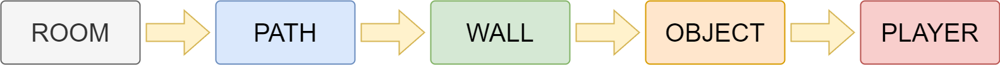

**The University of Melbourne**
# COMP30019 – Graphics and Interaction

## Teamwork plan/summary

<!-- [[StartTeamworkPlan]] PLEASE LEAVE THIS LINE UNTOUCHED -->

<!-- Fill this section by Milestone 1 (see specification for details) -->

Each team member will take responsibilty for different aspects of the game.
- Samarth: Camera control, Objects and entities
- Jack: Shaders
- Hanbin: Particle Systems
- Yifan: Procedural Generation
- Team: Storyline and mechanincs planning
We will split up in pairs to discuss the design and mechanics of each level.
The team will meet twice a week on Sunday 4pm and Wednesday 7:30pm for the duration of the project.

<!-- [[EndTeamworkPlan]] PLEASE LEAVE THIS LINE UNTOUCHED -->

## Final report

### Table of contents
* [Game Summary](#game-summary)
* [Technologies](#technologies)
* [Game Instructions](#game-instructions)
* [Key Gameplay Decisions](#key-gameplay-decisions)
* [Graphics Pipeline](#graphics-pipeline)
* [Procedural generation](#procedural-generation)
* [Particle System](#particle-system)
* [Querying and Observational Methods](#querying-and-observational-methods)
* [Game Changes](#game-changes)
* [References and Resources](#references-and-resources)

### Game Summary
`The Legend of Azreal: Mystic Flames` revolves around the central protagonist ‘Azreal’ who must defeat enemies to progress through the dungeon with the ultimate goal of defeating the ‘Mystic Flames’- the final boss. Along the way Azreal may unlock unique abilities as well as upgrade his stats to become stronger and assist in surviving the dungeon. The game could be described as a 3rd Person RPG Dungeon Explorer with arcade puzzle games intertwined. 

### Technologies
Project is created with:
* Unity 2022.1.9f1 
* Ipsum version: 2.33
* Ament library version: 999

### Game Instructions
As described above, the game is a classic RPG with conventional controls listed below:

* `WASD` keys for `up`, `left`, `down` and `right` respectively movement binds

* `E` to interact with objects such as chests and teleporters

* `ESC` to pause the game

* `Left-click` to attack or `click` on menus in game

* `Right-click` to block attacks

* `Space` to dodge roll in the `WASD` direction

The mouse is used to determine the direction the player faces

Where applicable `R` will reset the puzzle room and `F` will return to the dungeon from the puzzle room

When applicable the numbers `1` and `2` on the keyboard will activate abilities 1 and 2 respectively.

`Note:` Exiting to the menu will restart the game.

The game will begin from the menu to adjust sound etc. When commencing the game the player may opt to do the tutorial which is a more friendly environment to learn game mechanics and will prompt the player to test key binds. From here the player may return to the menu to begin the game or when they die in the tutorial the game will commence. 

Progress through each level to find the teleporter to the next level. There are bosses after levels `5` and `10`. Defeating the final boss will complete the game. The player may unlock abilities from chests or interact with the trader to spend gold and upgrade stats. If the player dies their stats and abilities will remain however the player will be sent back to level 1. Additionally there are teleporters to the puzzle room of each level which allow the player to unlock an ability.

In the puzzle rooms the player must push all boxes to their end point marked by the orbs. The boxes will glow to indicate they are on an endpoint. Exit the room using `F` described above as well as in the in game prompt. This will return you to the level to continue exploring.

Player’s Ability Clarification:

* `Damage`
Increase player's attack damage for a duration of time

* `Speed`
Increase player's movement speed for a duration of time

* `Defense`
Increase player's defense for a duration of time

* `Attack Speed`
Increase player's attack speed for a duration of time

* `Big Damage`
Increase the damage of player's next attack by 100

* `Heal`
Restore all health to the player

### Key Gameplay Decisions

The game took inspiration from common games of the genre such as Binding of Issac which was the foundation for the dungeon style. Puzzles were introduced to provide a rounded experience and complement the high tempo combat with slow calculated movement. A standard feature in the genre, upgrades were implemented to provide a means of progression for the player and a chance to get stronger as the map becomes more perilous around them. Furthermore, abilities provide a more dynamic gameplay experience and allow the player to customise gameplay to suit their style.

In terms of implementation, a key decision was the randomised map each level. As discussed in a further section we felt that this was key in order to provide a unique experience each playthrough and prevent the game from growing too stale. Additionally, we found that ironically this artificially created environment felt more natural than premaking levels. In this vein, additional randomness in the chest abilities, trader dialogue etc add to this fresh feeling each playthrough.

### Graphics Pipeline

`Shader 1` - Level Spawn Points
(Path: Assets/Shaders/SpawnShader)
As mentioned above, each level contains a teleporter that the player must locate to proceed to the next level. To enhance the visibility of the teleporters and make them stand out to the player, we decided to implement a vertex shader to create a circular wave-like effect inside the teleporters.

The shader takes each vertex and uses a sin function to manipulate the y coordinate of each vertex to form a sin wave on the material. The input to the sin function is manipulated so the wave originates from the center of the object and ripples outwards.

After the vertex transformations are complete, a tint color is added to each vertex to make the texture appear brighter/neon to make the transporter more visible.

`Shader 2` - Always Visible shader
(Path: Assets/Shaders/AlwaysVisible)

Due to the camera angle in the game, the character can be blocked by the wall beneath them when the character is too close to the wall, so in order to let the player know where the character is, this shader is used to render the character even when they are blocked by the walls. The shader has 2 passes. The second pass is just the standard shader, where the first pass is used to render the character with the set color (white). So when the character is blocked, the render from the second pass can not be seen, but the first pass can always be seen as the queue is set to be transparent. 

### Procedural generation

In the game, each dungeon level is procedurally generated, including the rooms, paths and the objects/enemies inside. 
The generation process follows the following routine:

  

The rooms are the foundations of all levels which consists of two types, the pre-made rooms and procedurally generated rooms. The pre-made rooms are used for boss fights and puzzle solving. With pre-made rooms, the option to fine tune aspects of the rooms is available without affecting the rest of the level. The generated rooms fill up the majority of the level, which is what makes the game exciting to explore, as the playground will always be different each playthrough, encouraging player exploration.

In order to generate the rooms, the BSP (binary space partitioning) algorithm is used to split a defined rectangular space into smaller rectangular pieces. During the process, the size of each rectangle and its location on the defined space are recorded, so the data can be used later on to instantiate rooms in the game engine. The rooms are designed so that they do not collide or intersect with each other. Inorder to achieve this goal, an offset of 1 unit has been applied to the instantiation process, where the room bounds has been shrunk by 1 unit on each side.

To generate paths, iterating over the room data collected earlier with the BSP algorithm allows connection of the center of each room to the center of its closest neighbor. This ensures that every room on the map can be reached by the player.

The coordinates of each floor in every room and path are recorded to keep track of exactly where they are and make sure that they do not overlap with each other. These coordinate data will help determine where the walls are going to be placed and also allow adjustment to their corresponding rotation. The script checks whether the up, down, left and right coordinates surrounding a floor tile, if either one is not populated by a floor tile, a wall position will be generated with offset, so it is always on the edge of the floor tile.

Once the walls are generated, the map generation process is completed. An empty playground that needs to be filled with enemies and objects will be available. The enemies and objects are generated based on the room data recorded. Thresholds of room sizes are determined, so that for rooms within a certain size, a certain number of enemies and objects will be allowed in that room, which with experiments and tuning allows rooms with optimal amount of action to be generated. For example, a 4x4 room is going to have 4 crate objects spawned inside, 4 pillars, and number of enemies depending on their types.

  

  

  

In the last stage of the procedural generation process, the player is going to be generated. To generate the player, a special floor tile will be generated in the first room of each level, with only the spawn tile on the first level actually spawning the player, and the rest acting as a coordination tile where the player can teleport to. This design choice allows us to preserve the status of the character throughout the playthrough.

### Particle System

The particle system can be found under `Assets/Particle System/FlameThrower_PS`. 
This is used as a special effect for the flame throw ability of the dragon boss. Duration is set to be 2 and there is 0.6 on the start delay to make it fit the flamethrow animation of the dragon boss. Start speed is set to be randomized between 30 and 50 so that the flame overall shape looks more natural other than a standard perfect cone shape. The start size is also set to be varied between 8 and 10 to make the flame look more realistic. Emission rate over distance is set to be decreasing from 1 to 0.5.  The shape of the particle system is set to be a cone. The angle is 10 and radius is 0.1. The value is acquired through play testing to see what is an optimal range that the flamethrow should cover and can also be dodged reasonably. Collision is enabled to detect collisions with the player to deal damage. Lifetime loss is set to be 1 so the flame cease to exist once it hits the player.

### Querying and Observational Methods
For the observational method, we decided to use the cooperative evaluation method. This involved gathering a group of participants and asking them to play the game. After they successfully/unsuccessfully completed the game, we used a querying method to gather the participants' observations and comments.

We decided to use Questionnaire as the querying method to gather feedback from playtest participants. The Questionnaire is created using SurveyMonkey, consisting of ten questions, covering the functionality and quality of life aspect of the game. The survey was taken by participants after a full playthrough of the game. The result turned out to be helpful, as many functional bugs have been identified and opinions have been collected from potential players to give us the direction we need to improve the game and what needs to be done before the game gets released. 

See detailed responses from participants: https://www.surveymonkey.com/results/SM-3MG9UdcDqVwHF4yaCTd6mw_3D_3D/

### Game Changes

With the data collected, we managed to fix many gaming breaking bugs such as player spawning outside the map, upgrade shop does not work after death, and puzzle rooms not instantiating properly. Visuals of the game have also been improved, with feedback from participants suggesting that the levels are too bright, we are able to tune down the lighting, so that the game fits the taste of targeted players.

### References and Resources
https://xdavidleon.tumblr.com/post/51104205836/roguelike-development-in-unity-part-i

https://www.youtube.com/watch?v=gHU5RQWbmWE

https://www.youtube.com/watch?v=-QOCX6SVFsk&t=2s

https://www.youtube.com/watch?v=zc8ac_qUXQY&t=117s

https://sqrt9.com/post/unity-shi-yong-bsp-cheng-xu-hua-sheng-cheng-di-tu/

https://www.gamedeveloper.com/programming/procedural-dungeon-generation-algorithm
